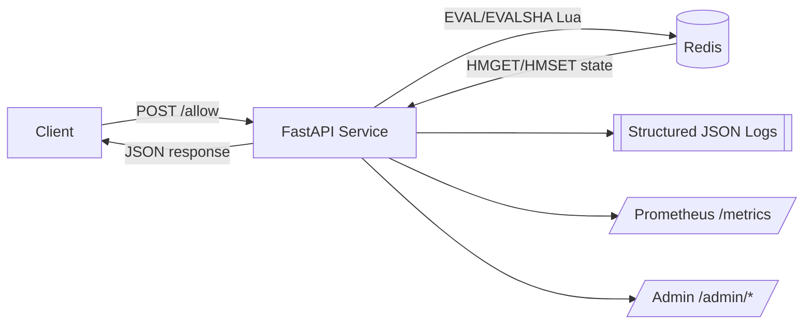

# r8limiter 🚦
*A distributed, Redis-backed rate limiting service with observability and Kubernetes-ready deployments.*

[](LICENSE)
[](https://github.com/<your-username>/r8limiter/actions)
[](https://hub.docker.com/r/<your-username>/r8limiter)
[](#)

---

## ✨ Features
- **Token Bucket Algorithm** – fair per-user throttling
- **Distributed State** – Redis-backed with atomic Lua scripts
- **Admin API** – stats, top offenders, per-user tokens
- **Observability** – Prometheus metrics, structured JSON logs
- **Kubernetes-Ready** – Helm charts, HPA, and dashboards

---

## 🖼️ Architecture Overview



---

## 🚀 Quickstart
```bash
# 1) Start stack
docker-compose up --build

# 2) Hit the endpoint (allows up to capacity, then throttles)
curl -i -X POST "http://localhost:8000/allow?user_id=a&resource=read&cost=1"

# 3) Idempotent call (won’t double-spend within TTL)
curl -i -X POST "http://localhost:8000/allow?user_id=a&resource=pay&cost=1" \
  -H "Idempotency-Key: 12345"
curl -i -X POST "http://localhost:8000/allow?user_id=a&resource=pay&cost=1" \
  -H "Idempotency-Key: 12345"
```

---

## 🔧 API Spec

### 📑 Endpoints Table

| Method | Path | Description |
|--------|------|-------------|
| **Core** |
| `POST` | `/allow` | Spend tokens for `(user_id, resource)` (supports idempotency) |
| **Admin** |
| `GET` | `/admin/stats` | Global counters and top-N offenders |
| `GET` | `/admin/user/{user_id}` | Per-user tokens + refill ETA |
| `GET` | `/admin/resources` | Discovered resources + persisted config |
| `GET` | `/admin/top_offenders` | Time-windowed offenders (minute/hour/day) |
| **Observability** |
| `GET` | `/metrics` | Prometheus metrics exposition |
| **Health** |
| `GET` | `/readyz` | Readiness probe (Redis + Lua healthy) |
| `GET` | `/livez` | Liveness probe (process healthy) |

---

### Core

#### `POST /allow`
Tries to spend tokens for `(user_id, resource)`.

**Query parameters**
- `user_id` (string, required)
- `resource` (string, default `"default"`)
- `cost` (int, default `1`)
- `idempotency` (string, optional)

**Responses**
- `200 OK`
```json
{"allowed": true, "retry_after": 0.0, "tokens_left": 7.4}
```
- `429 Too Many Requests`
```json
{"allowed": false, "retry_after": 0.22, "tokens_left": 0.8}
```

---

### Admin

#### `GET /admin/stats`
Global totals and top offenders.

#### `GET /admin/user/{user_id}`
Per-user snapshot.

#### `GET /admin/resources`
List discovered resources with persisted configs.

#### `GET /admin/top_offenders`
Time-windowed offender aggregation.

---

### Observability

#### `GET /metrics`
Prometheus text exposition with:
- `requests_total{result="allow|deny"}`
- `active_keys`
- `request_latency_seconds_bucket{endpoint="..."}`

---

### Health

- `GET /readyz` → readiness (Redis + Lua OK)
- `GET /livez` → always returns alive

---

### Logs

All requests emit structured JSON logs.

---

## 📊 Grafana Dashboards (PromQL)

Example PromQL queries for dashboards:

- **Requests allowed vs denied**
```promql
sum(rate(requests_total{result="allow"}[1m])) by (result)
```

- **Active keys over time**
```promql
active_keys
```

- **p95 request latency (per endpoint)**
```promql
histogram_quantile(0.95, sum(rate(request_latency_seconds_bucket[5m])) by (le, endpoint))
```

You can import these queries into a Grafana dashboard panel for quick visibility.

---

## 🎯 Goals 
- SLO: p99 < 10ms for in-memory
- < 25ms Redis
- correctness beats raw speed.

## 📂 Repo Layout
```
r8limiter/
├─ app/
│  ├─ __init__.py
│  ├─ app_async.py
│  ├─ limiter.lua
│  ├─ lua_limiter_async.py
│  ├─ requirements.txt
│  └─ settings.py
├─ tests/
│  ├─ __init__.py
│  ├─ test_integration.py
│  └─ test_rate_limiter_redis.py
├─ (TBD) deploy/
│  ├─ docker/Dockerfile
│  ├─ docker/docker-compose.yml
│  ├─ helm/Chart.yaml
│  ├─ helm/values.yaml
│  └─ helm/templates/*.yaml
├─ (TBD) ops/
│  ├─ k6-smoke.js
│  ├─ dashboards/prometheus-rules.yaml
│  └─ dashboards/grafana.json
├─ docker-compose.yml
├─ Dockerfile
└─ README.md
```

## 📝 Design Doc
[Rate Limiter Design](https://docs.google.com/document/d/1i_ah88lqwMl0kePaDvHtoqmIu5Zeh3Vv/edit?usp=sharing&ouid=107042604300121152772&rtpof=true&sd=true)

## 🗂 Legacy Code and Tests
Located in the /legacy directory
```
legacy/
├─ app/
│  └─ rate_limiter.py
├─ tests/
│  └─ test_rate_limiter.py
```

```bash
# Run locally (Uvicorn)
uvicorn app.main:app --reload

# Run locally (FastAPI Dev)
cd app/
fastapi dev main.py

# Run locally (Docker Compose)
docker compose up --build

# Test a request
curl -X POST "http://localhost:8000/allow?user_id=test"

# Run Unit + Integration Tests
pytest -q
```
